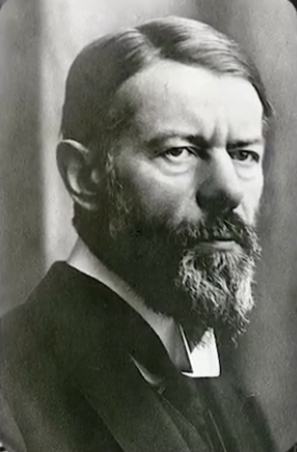
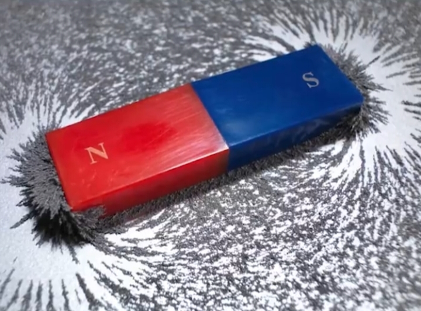

# ادعای ملحد

<video src="./claim-part1.mp4" controls>

# جواب 

پیامبر میگه سنگ سیاه (یعنی حجر السود)
از بهشت به زمین اومده نه اینکه فرشته بوده 
و تبدیل به سنگ شده و مسلمانان حجر السود رو نمی پرستن
بلکه اونو به عنوان یک نشانه و سنت پیامبر محترم میدونن
و بوسیدن و لمس کردن این سنگ 
فقط یک عمل نمادینه 
و اون قاب دور سنگ هم 
در سال ۱۶۴۰ میلادی یعنی ۱۰۰۰ سال 
بعد از وفات پیامبر به دستور سلطان مراد عثمانی 
برای حفاظت و استحکام بیشتر بر روی 
حجر السود نصب میشه 

<video src="./claim-part2.mp4" controls>

# ادامه جواب

مشرکین مکه قبل از اسلام 
الله رو به عنوان خالق یکتا 
قبول داشتن نه به عنوان یک بت
و در کنال الله بت هایی رو به عنوان شریک 
و واسطه بین خود و الله میدونستن 

#### ماکس وِبر ، جامع شناس و تاریخ نگار برجسته آلمانی

در کتاب معروف خودش « **جامعه شناسی دین** » میگه :
الله در دوران جاهلیت به عنوان خدای یکتا 
در بین قبایل عرب بود و بتی به عنوان الله وجود نداشته 
و الله اکبر یعنی خدا از هر چیز قابل تصوری بزرگتره 
الله اکبر بیانی از شگفتی و تسلیم در برابر خداست و میگه
هیچ چیز با عظمت خدا برابری نمیکنه 

<video src="./claim-part3.mp4" controls>

# ادامه جواب
شهادت دادن صرفا به معنای دیدن با چشم نیست 
بلکه به معنای گواهی دادنه
دیدن یکی از راه های درک و نتیجه گیریه 

شنیدن ، لمس کردن ، بوییدن و چشیدن

حواس دیگه ما هستن که میتونن مارو به یک نتیجه گیری برسونن
همه ما میدونیم که امواج رادیواکتیو 

برای بدن مضره ولی چون ما اونو با چشم نمی بینیم 
آیا میتونیم اونو انکارش کنیم ؟ 
امواج الکترو مغناسیطی

نیرو گرانش 

امواج مادون قرمز 

نیروی جاذبه در آهن ربا 

و خیلی چیز های دیگه هم 
با چشم دیده نمیشن
اما اثر اونها برای ما قابل درکه 
و ما به وجود اونها باور داریم 
همینطور که در شهادتین میگیم 
### اشهد ان لا اله الا الله
### یعنی گواهی می دهم خدایی جز الله نیست
نه اینکه با چشم می بینم
یعنی من با فکر و تعقل و اندیشیدن 

در نطم پیچیدگی های جهان هستی با قلبم باور دارم 

و با زبانم اعلام میکنم 

مثل دانشمند معروف 
آنتونی فِلو ، استاد دانشگاه آکسفورد

و یکی از معروف ترین آتعیست های جهان 
که فقط با برسی نظم در جهان هستی در سن ۸۱ سالگی 
به وجود خدا میرسد و
 کتاب معروف خود به نام خدا وجود دارد را مینویسه
و چه زیبا خداوند در آیه ۳ سوره مُلک میگه 

### در آفرینش خداوند هیچ گونه ناسازگاری نمیبینی ،
### نگاه کن آیا خطا و خاای میبینی ؟