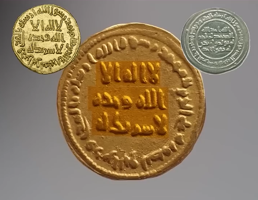
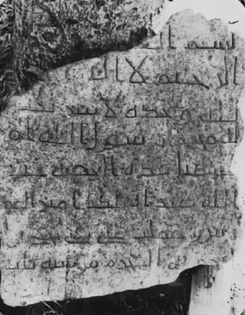
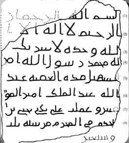
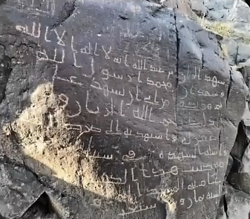
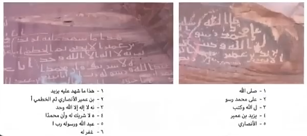
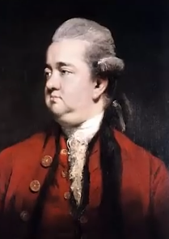
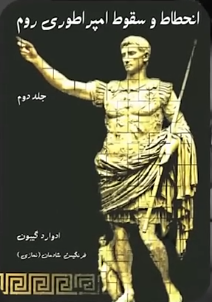

# ادعا ملحد

[مشاهده ویدیو](./claim.mp4)

# پاسخ 

### اولین سکه ای که نام پیامبر روی اون حک شده
### مربوط به سال 693 میلادی یعنی 64 سال بعد از وفات پیامبر 
### در زمان عبدالملک بن مروان ضرب شده
### که روی ااون سکه نوشته شده محمد رسول الله 

### و بعد از اون در کشور هایی که قلمروی مسلمانان می شد 
### سکه ها با نام محمد رسول الله ضرب میشد 

### قدیمی توین کتیبه در اسلام 

    
    

### کتیبه عقبه هستش که قدمت اون 
### به سال 73 هجری قمری بر میگرده 
### که این کتیبه مربوط به   
### افتتاح جاده هست که در اون
### از نام محمد رسول الله استفاده شده

### سنگ نوشته بازسازی مسجدالحرام

### که به سال 78 هجری قمری بر میگرده
### این کتیبه نیز 
### یکی از کتیبه های اولیه اسلامیه 
### که در منطقه حومة المنور 
### در شمال غربی طاعف یافت شده
### که در این کتیبه نام محمد رسول الله ذکر شده است

### این دو کتیبه نیز حاوی شهادت و صلوات بر حضرت محمد هستن 
### که مربوط به اواخر قرن اول هجری قمری هستن

### ادوارد گیبون 

    
    
    

    <h1>
        ادوارد گیبون 
    </h1>
    

        نویسنده و تاریخ نگار انگلیسی در متاب معروف خودش تاریخ زوال و سقوط امپراتوری روم در جلد پنجم میگه :
    

    <h3>
    درایت محمد تجملات سلطنت را تحقیر میکرد محمد کار های روزمره خانه اش را انجام میداد ، آتش روشن میکرد ، زمین را جارو می کرد ، گوسفندان را می دوشید ، و با دستان خود کفش ها و لباس هایش را وصله میکرد
    </h3>
    

### او بدون اینکه بخواهد ریاضت بکشد و یا وانمود بکند 
### که زاهد است سبک زندگی ساده و بی تکلفی را در پیش گرفت بود