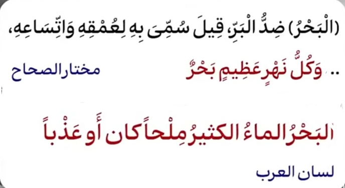
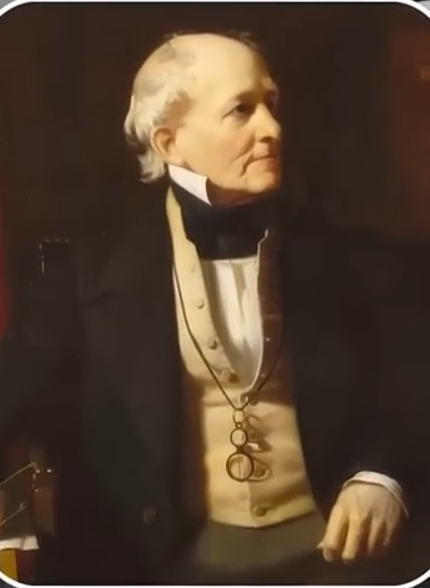
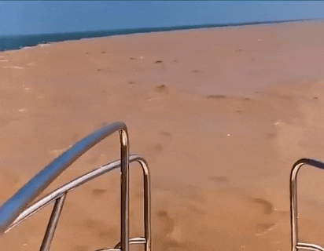
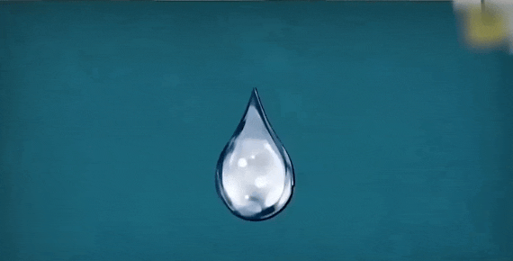
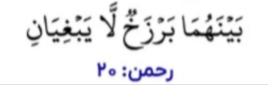

# ادعای ملحد

<video src="./claim.mp4" controls>

# جواب 

واژه بحر در زبان عربی مه معنای دریا
 ، توده بزرگ آب ، رودخانه وسیع و حتی
 دریاچه بزرگ هم گفته میشه
در اوایل قرن ۱۹ میلادی 

فرانسیس بوفورت (Francis Beaufort) دانشمند بریتانیایی
با کشف مفهوم "هالوکلاین" Halocline
مرز بین آب های شور و شیرین رو مشخص میکنه

------

و ژاک کوستو (Jacques Cousteau)
اقیانوس شناس فرانسوی در اوایل قرن ۲۰ 
با استفاده از تجهیزات پیشرفته علمی 
مرز بین آب های شور و شیرین رو 
مشاهده و مستند میکنه 

به طور مثال ، دریای بالتیک که آب شیرینی داره
 و دریای شمال که آب شوری داره که در اروپا واقع شدن
در محل تلاقی این دو دریا 
مرزی بین اونها وحود دارد که کاملا مشخصه 

رود خانه می سی سی پی آمریکا 
که حجم عظیمی از آب شیرین رو به خلیج مکزیک میریزه
که باز هم مرز این دو آب کاملا مشخصه 

اما چرا آب شور و شیرین باهم دیگه قاطی نمیشن؟
از نظر علمی بخاطر چگالی متفاوتی که دارند 
آب شور سنگین تر از آب شیرینه 
و لایه هالو کلاین یک منطقه انتقالی 
بین آب شیرین و شور ایجاد میکنه

اما چطور قران ۱۴۰۰ سال قبل به این پدیدع اشاره کرده ؟ 
ومیگه :

 

### مانعی است که به هم ورود (تجاوز) نمی کنند 

و علم مدرن امروز این حقیقت رو تایید میکنه 
و حالا و حرف شمارا قبول بکنیم

یا حرف پروفسور ویلیام های دانشمند برجسته 
William W. Hay
اقیانوس شناس آمریکایی که میگه 

#### اطلاعاتی که در قرآن درباره
#### آب های شور و شیرین امده است 
#### کاملا با یافته های علمی مدرن 
#### مطاقبت دارد و این نشان میدهد
#### که اطلاعات این کتاب از منبع
#### غیر از دانش انسانی امده 

حالا حرف شمارو باور بکنیم ؟
یا حرف متخصصین اقیانوس شناس رو ؟