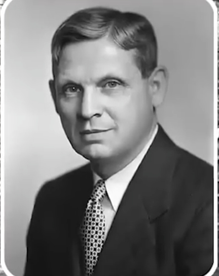
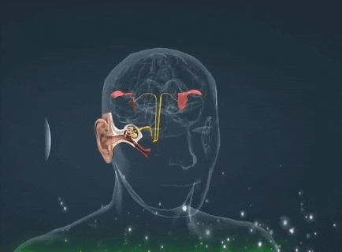
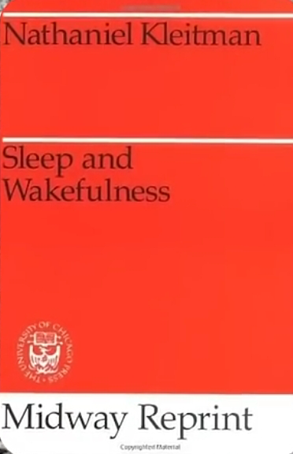

# ادعا

<video src="./claim.mp4" controls>

# جواب 

در سال 1953 ناتانیل کلایتمن فیزیولوژیست و دانشمند آمریکایی که از او بعنوان پدر علم خواب جهان یاد میکنن کشف کرد که 
#### گوش ها تنها عضو بدن هستن که که در هنگام خواب هم فعالن

او در کتاب معروف خودش خواب و بیداری میگه 

#### گوش ها در هنگام خواب اطلاعات محیطی را دریافت و به مغز میفرستن به همین دلیله که ما برای بیدار شدن نیاز به ساعت زنگدار داریم

قرآن 1400 سال قبل به این حقیقت علمی اشاره میکنه و در آیه 11 سوره کهف خدا درمورد خفتگان غار میگه :
### پس در آن غار سالیانی چند بر گوش هایشان پرده زدیم
خدا بجای اینکه مستقیما بگه ما آنها را خواباندیم از این تعبیر استفاده میکنه و بیانگر این واقعیت علمیه که 
خدا تنها عضو فعال در بدن اونها را غیر فعال میکنه تا اونها با آرامشی عمیق در خواب فرو برن 

اخیرا دانشمندان کشف کردن : وقتی فردی برای مدت طولانی حرکت نکنه بدنش به مرور دچار مشکلاتی شامل زخم بستر ، ضعف عضلانی ، پوکی استخوان ، مشکلات تنفسی ، لخته شدن خون ، و یبوست میشه

و از نظر دانشمندان بهترین راه برای پیشگیری از این مشکلات اینکه بدن در طول شبانه روز تغییر وضعیت بده و چقدر زیبا خداوند در آیه 18 سوره کهف میگه 

### درحالی که خفته اند آنها را به پهلوی راست و پهلوی چپ می گردانیم 

این واقعیت علمی چطور امکان داره 1400 سال قبل توسط فردی که سواد خوندن و نوشتن نداشته اینقدر دقیق گفته شده باشه فقط میشه گفت **سبحان الله**
اگر این فکت های دقیق علمی که درقرآن بهشون اشاره شده معجزه نیست پس چیه ؟