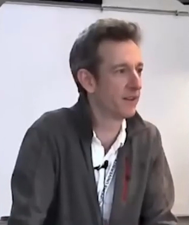
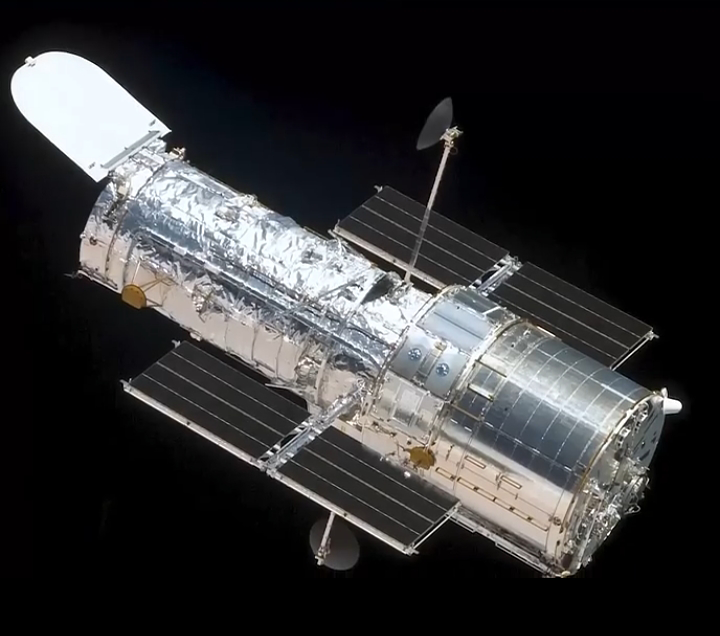
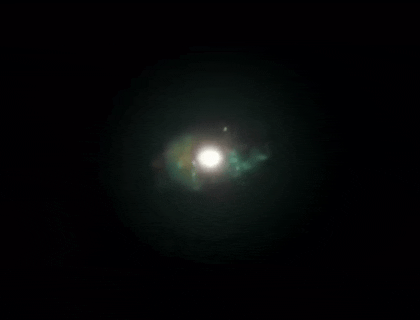
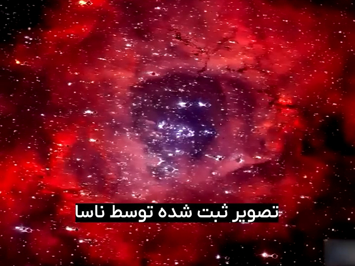
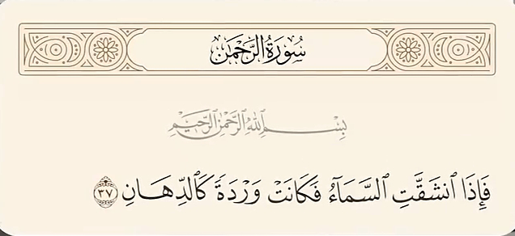
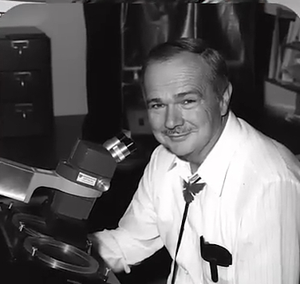
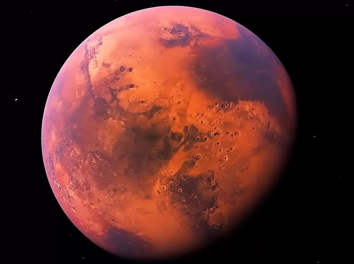
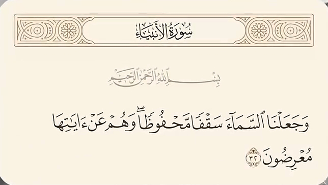

# جواب

    

در سال 2003 رابرت کالدول فزیکدان نظری و همکارانش کشف کردن ** انرژی تاریک دارای ماهیت خاصی است که با گذر زمان قوی تر میشه ** ،
**نیروی دافعه آن بر گرانش غلبه میکنه و نه تنها کهکشان ها بلکه ستاره ها ، سیارات و حتی اتم هارا هم از هم خواهد شکافت **

    

در نظریه پارگی بزرگ دانشمندان میگن : 
#### کیهان به شکل شگفت آوری گسترده میشه و به درجه ای از گستردگی میرسه که سوراخ ها و شکاف های بزرگی در اون ایجاد میشه
و دقیقا خداوند از این حقیقت علمی در قرآن سخت گفته و میگه : 
### آسمان شکافته خواهد شد

    
    

 و در سال 1995 تلسکوپ فضایی هابل تصویری از یک ستاره ثبت کرد که به شکل گل سرخ به نظر می رسید 
 این پدیده زمانی رخ میدهد که یک ستاره عظیم منفجر بشه و لایه های بیرونی اون به فضای اطراف پرتاب بشن 

    
    

 
 جالبه بدونید خداوند در آیه 37 سوره رحمان میگه : 
 ### آسمان شکافته خواهد شد و مانند گل سرخ خواهد شد .
 این ابر نواختر تقریبا 5200 سال نوری از زمین فاصله داره
 چطور ممکنه این قدر دقیق خداوند در قرآن بهش اشاره کرده باشه

 

    
    

 و یوجین شومیکر زمین شناس و ستاره شناس معروف آمریکایی که از پیشگامان علم برخورد شهاب سنگ ها به زمین است 
 در سال 1971 کشف میکنه که زمین دارای یک سقفه و به همین دلیله که بیشتر شهاب سنگ ها قبل از رسیدن به سطح زمین منفجر میشن 
 و در نتیجه تنها قطعات کوچکی از آنها ممکن است به سطح زمین برخورد کند 
 و جو زمین یا اتمسفر را میتوان به عنوان یک سقف طبیعی برای سیاره زمین در نظر گرفت که 
 از زمین در برابر پرتو ها کیهانی ، شهاب سنگ ها و اثرات مخرب تابش خورشیدی محافظت میکنه
 اگر سقف زمین وجود نداشت شرایط برای زندگی غیرممکن بود و زمین به یک سیاره مرده و بی آب و علف مانند مریخ تبدیل میشد 

    

 به عبارتی این سقف شفاف و نامرئی یکی از مهمترین عوامل بقای حیات روی زمینه 
 و خداوند 1400 سال قبل در آیه 32 سوره انبیاء به این حقیقت علمی اشاره میکنه و میگه : 

    

 ### آسمان را سقفی محفوظ قرار دادیم
 اگر اینا اسمش **اعجاز** و **معجزه** نیست پس چیه