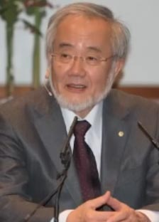
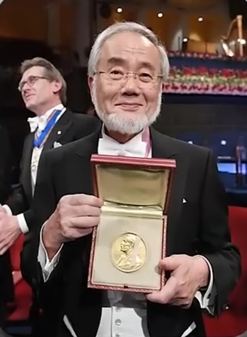

# ادعای ملحد

<video src="./claim.mp4" controls>

# جواب 

  

اوایل سال ۲۰۰۰ **یوشینوری اسومی** دانشمند ژاپنی 
مکانیزمی به نام **اتوفاژی** را در بدن انسان کشف میکنه 
اتوفاژی یعنی فرآیند خود **خواری سلولی** که در اون 
سلول ها پروتئین های آسیب دیده و اجزای بی استفاده خودش رو 
تجزیه و بازیافت میکنه زمانی که بدن وارد فاز روزه داری میشه
سطح انسولین بدن کاهش پیدا مبکنه و بدن برای تامین انرژی 
به منابع دیگه ای از جمله **ذخایر چربی** رجوع میکنه

  

این تغییرات متابولیک باعث فعال شدن فرآیند اتوفاژی میشه 
در شرایط روژه داری بدن بجای مصرف مواد غذایی 
شروع به استفاده از منابع داخلی خودش میکنه 
و این فرآیند به پاکسازی سلول ها کمک و
مثل یک تیم نظافتچی عمل میکنه 
و پروتئین های معیوب 
و اندامک های آسیب دیده رو تجزیه و از بین میبره 

  

با فعال سازی اتوفاژی توسط روزه داری تاثیر مستقیم آن  
در بیماری هایی مثل آلزایمر که پروتئین های غیر طبیعی 
در مغز تجمع پیدا میکنه و این پروتئین ها را تجزیه 
و از بروز مشکلات مغزی جلوگیری میکنه

  

تاثیر روزه داری به همینجا ختم نمیشه
با افزایش سن سلول های آسیب دیده بیشتر میشه
که باعث التهاب و پیری میشه 
این فرآیند با حدف این سلول های ناسالم 
روند پیری رو کند میکنه و با از بین بردن 
سلول های معیوب از گسترش سلول های پیش سرطانی جلوگیری
وسیستم ایمنی بدن رو تقویت میکنه 

  

و درسال ۲۰۱۶ این دانشمند ژاپنی
 به دلیل کشف مکانیزم اتوفاژی 
برنده جاییزه نوبل فیزیولوژی و پزشکی میشه

  

روزه داری نه تنها یک عبادته 
بلکه از نظر علمی نیز 
یک روش فوق العاده برای سلامتی بدن و
بازسازی سلولی به شمار میره

تحقیقات علمی مدرن نشان داد
روزه ماه مبارک رمضان یک راهکار طبیعی 
برای افزایش طول عمر و پیشگیری از بیماری و
جوانسازی بدنه 

آیا این خود نشان دهنده قدرت و علم بیکران خداوند نیست؟

روزه داری پلی است میان بندگی و سلامتی 
میان اخلاص و بقا میان تقوا و ترمیم 

حقیقتی که حکمت خداوند را در پس هرفرمانش
آشکار میکنه و روزه رو به معجزه ای برای جسم و جان تبدیل میکنه