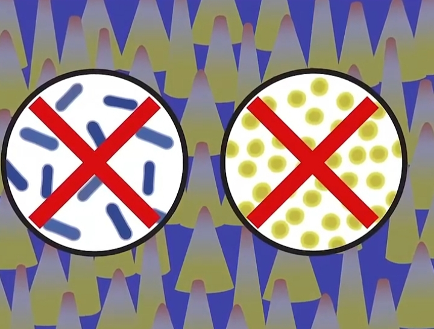
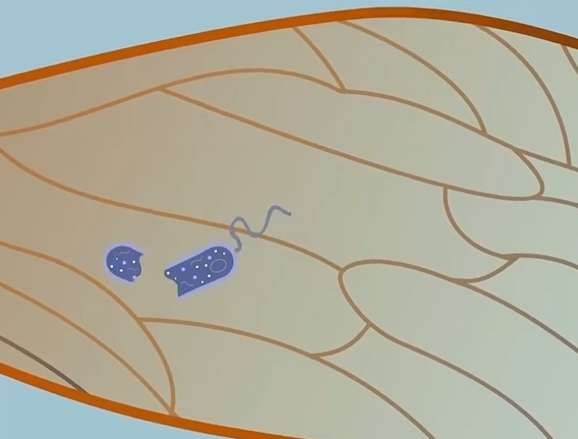

# ادعا 

<video src="./claim.mp4" controls>

# جواب

طبق تحقیقاتی که از سال 2010 تا سال 2017 توسط پروفسور **النا ایوانوا** از موسسه سلطنتی فناوری ملبورن استرالیا انجام شد

    
    

اون کشف کرد که در بال های مگس پروتئینی هایی با خاصیت ضد باکتری وجود دارند 
که میتونن باکتری های مضر را از بین برده و به عنوان ضد باکتری عمل کنن  

    
    

و پیامبر هیچ وقت نگفتن شما مگس پیدا بکنین و بندازین تو نوشیدنی تون 
بلکه میگن :
#### اگر مگسی توی نوشیدنی هر کدوم از شما افتاد اون مگس رو بیرون بیارین و اون نوشیدنی رو بنوشید
اونم تو منطقه خشک و بی آبی مثل عربستان این راه حلشه
چیزی که علم مدرن العان بعد از 1400 سال اونو تایید میکنه 

حالا تو بهم بگو پیامبر از کجا میدونست در مگس چنین خاصیت ضد باکتری وجود داره ؟
چطور ممکنه در زمانه ای که هیچ میکروسکوپ و علم میکروب شناسی یا فناوری نانوی ای وجود نداشته 
پیامبر به چنین حقیقت علمی اشاره کرده 

اینو تو بهم جواب بده چطور ممکنه ؟! 