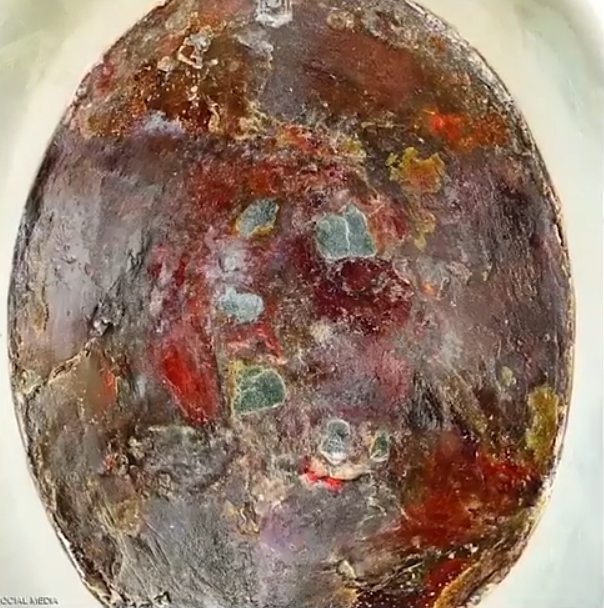
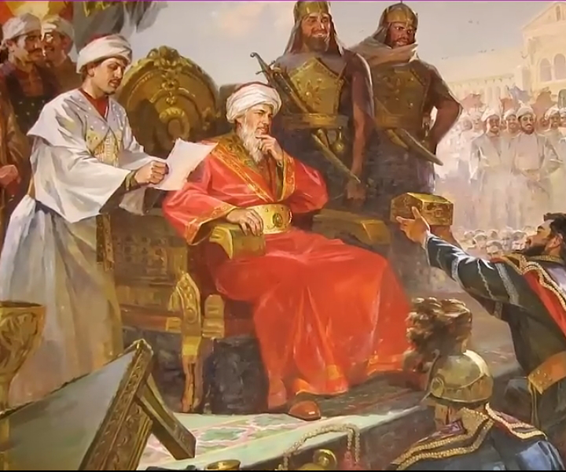
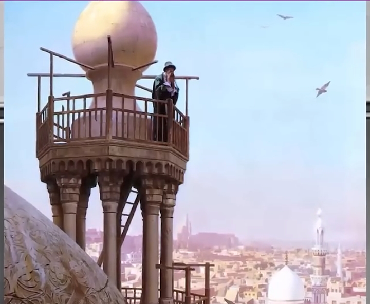
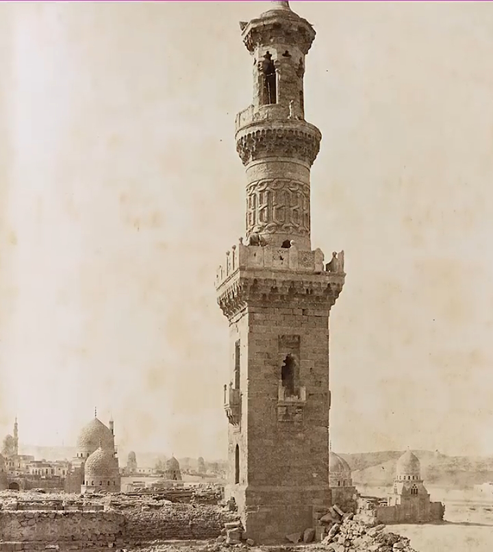
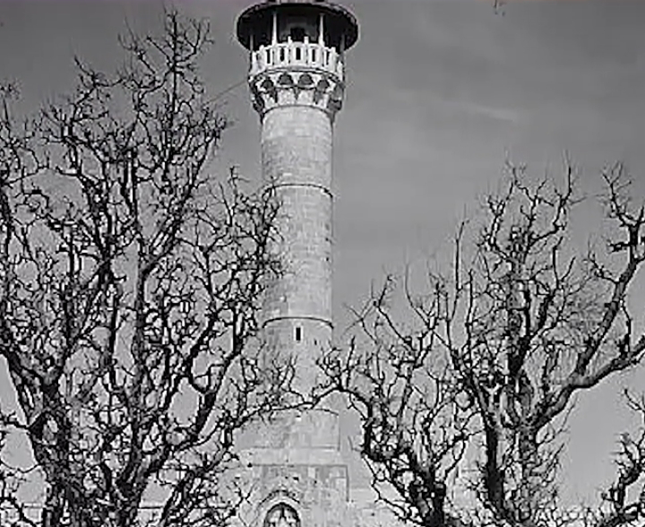
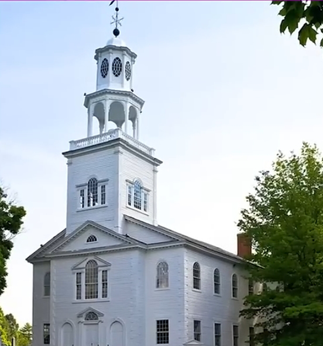
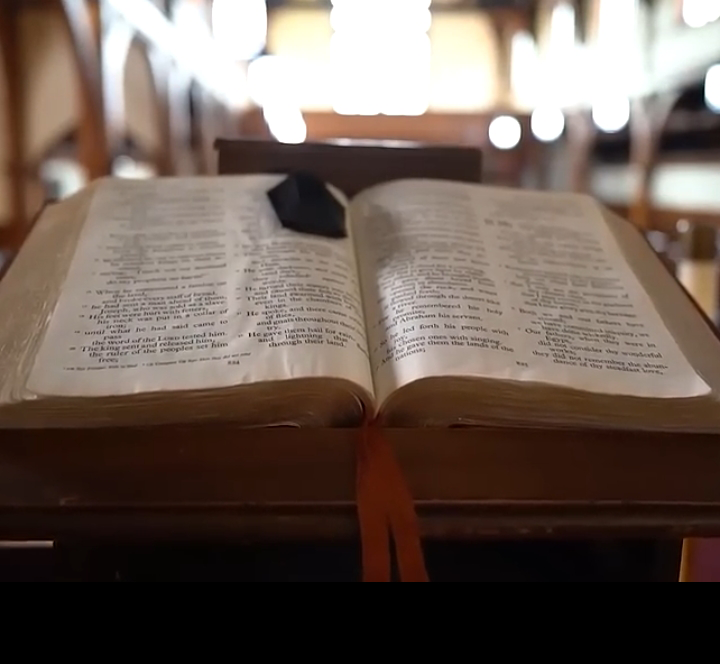

# ادعا

<video src="./claim.mp4" controls>

# جواب 

در سال 1640 میلادی یعنی هزار سال بعد از وفات پیامبر به دستور سلطان مراد عثمانی  قابی نقره ای برای حفاظت و استحکام بیشتر بر روی سنگ حجر السود نصب شد .

    
    
    

نصب قاب نقره ای به منظور حفاظت از این سنگ مقدس و جلوگیری از تخریب اون انجام شده .
مسلمانان حجرالسود رو نمیپرستن ، بلکه اونو به عنوان یک نشانه و سنت پیامبر محترم میدونن ، و بوسیدن یا لمس کردن این سنگ فقط یک عمل نمادینه

    
    

اولین نمونه مناره برای مساجد در سال 717 میلادی یعنی هشتاد و سه سال بعد از وفات پیامبر توسط ولید بن عبدالملک اموی ساخته میشه

    
    

مکانی برای موذن تا صدای اذان به گوش همه برسه و نشانه ای برای مسافران و رهگذران باشه که از فاصله دور متوجه بشن مسجد کجا هستش
مناره هیچ جایگاه عبادی در اسلام نداره و کاربردش مثل برج ناقوس کلیسائه

    

و در تاریخ عرب ها قبل از اسلام هیچ گونه شواهد مستندی دال بر وجود آلت پرستی وجود نداره 
و در انجیل یوحنا باب هشت آیات 7 تا 16 حضرت عیسی میگه 

    

**لیکن به شما راست میگویم که رفتن من برای شما مفید است زیرا اگر نروم تسلی دهنده نزد شما نخواهد آمد اما اگر بروم او را نزد شما خواهم فرستاد**
این فرستنده ای که حضرت عیسی بشارتش رو میده کیه ؟ (حضرت محمد)