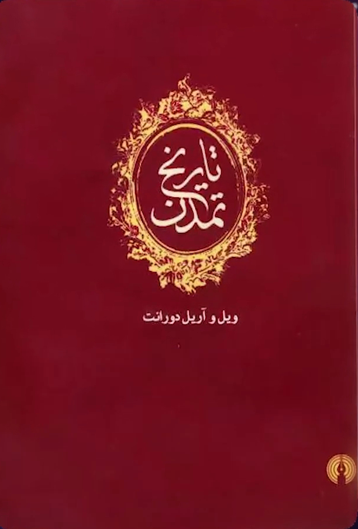

# ادعا

<video src="./claim.mp4" controls>

آقای کاشف بزرگ 
در اسلام چیزی به نام ازدواج با محارم نبوده 
زمانه که فعلی حرام میشه شما چرا اینو ربطش میدید به اسلام ؟

به طور مثال خداوند میگه : 
### شراب خوردن از این لحظه حرامه
اینو که اسلام نیاورده که الآن بیاد حرامش بکنه
جزء آداب و رسوم زمان جاهلیت شراب خوردن بود ، که تحریم شد

خداوند در آیه 23 سوره نساء می فرماید
(این اِه جز آیات مدنیه یعنی ده سال بعد از بعثت پیامبر نازل شده)
### ازدواج با محارم حرام شد
#### چرا : چون اسلام گسترش پیدا کرده بود از همه ادیان دیگه میومدن مسلمان میشدن
و متاسفانه این ازدواج با محارم جزو آداب و فرهنگ ساسانیان بوده
شما میتونید با یک سرچ خیلی ساده این کلمه رو پیدا کنید (خویدوده)
خویدوده یعنی ازدواج با محارم 

خویدوده که در کتاب روایت پلوی که مترجمش مهشید میرفخراییه میگه :

#### خویدوده چنان شگفت انگیزه که باعث نجات از دوزخ و پاک شدن همه گناهان و حتی بخشش گناه جادوگری که مجازاتش مرگه، میشه

چی باعث میشه گناهات بخشیده بشه ؟ خویدوده (ازدواج با محارم)
و خیلی از تاریخ نگاران به این ازدواج با محارم اشاره کردند

مثل تاریخ تمدن

ویل دورانت میگه :
خویدوده جزو آداب و رسوم ساسانیان بوده

یا در کتاب ایران زمان ساسانیان نویسنده آرتور گریستنسن اونم اشاره میکنه

و خیلی از نویسنده های دیگه اما شما چرا اینو ربطش میدید به اسلام ؟
شما فقط یک دلیل بیارید که  در اسلام ازدواج با محارم صورت گرفته 
مثلا فلانی به خواهر خودش ازدواج کرده فقط یک دلیل بیارید