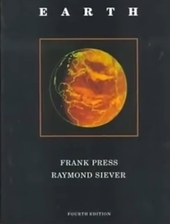
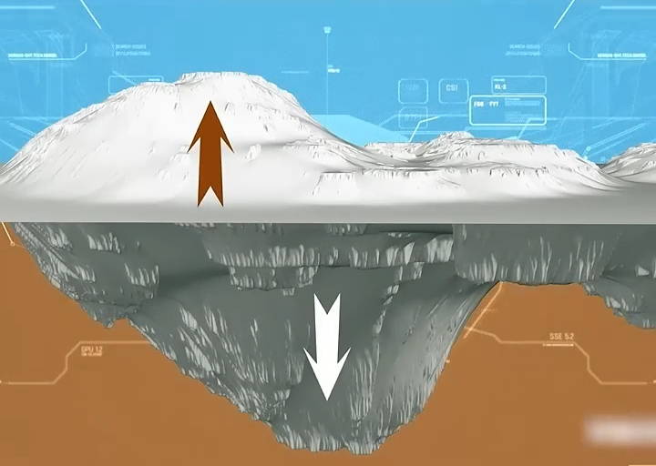

# ادعای ملحد

<video src="./claim.mp4" controls>

# جواب 

جناب آقای زمین شناس آیا واقعا هم اینجوریه ؟

در اواخر سال 1970 دانشمند برجسته زمین شناسی جان ساپ بعد از مطالعات زیاد به این نتیجه رسید که :

  

#### کوه ها نقش بسیار مهمی در کاهش زلزله ها و تثبیت پوسته زمین دارن 

ریچارد فاینمن فزیکدان برجسته آمریکایی  که موفق به دریافت جایزه نوبل شد

  
  

با شبیه سازی رایانه ای به نقش بسیار مهم کوه ها در جلوگیری از زلزله های شدید اشاره میکنه

  
  
  

و همچنین دکتر فرانک پرس که 12 سال رئیس آکادمی ملی آمریکا بوده و 
همچنین یکی از نویسندگان کتاب مرجع زمین شناسی به نام کتاب زمین نیز است
او در این کتاب کوه ها مثل میخ برای زمین معرفی میکنه که نقش بسیار مهمی 
در تثبیت پوسته زمین و جلوگیری از حرکات شدید زمین دارن 
و چه زیبا خداوند 1400 سال قبل به این فکت علمی اشاره میکنه و می فرماید : 
### در زمین کوه ها استواری قرار داد تا شما را نلرزاند
و همچنین می فرماید :
### کوه هارو میخ های زمین قرار دادیم 
این تطابق بین قرآن و علم نشان دهنده اعجاز علمه قرآنه 
که قران ها پیش از کشفیات علمی امروزه به اون اشاره شده 

آیا واقعا اگر قرآن کلام خدا نیست چطور 1400 سال پیش 
این همه فکت علمی درونش هست ؟