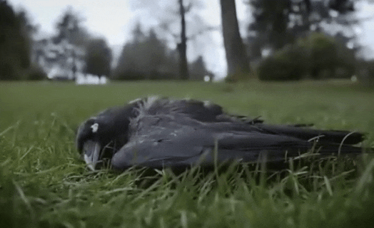

# ادعا 

<video src="./claim.mp4" controls>

# جواب 

نه در قرآن نه در منابع اسلامی اصلا چنین چیزی وجود نداره 
و حتی هیچ اشاره ای هم به این موضوع نشده 
خداوند در ایه 36 سوره مائده میگه :

### وقتی یکی از پسران آدم برادرش رو به قتل رسوند 
### نمیدونست با جنازه اش چیکار بکنه 
### پس خداوند کلاغی را معمور کرد
### تا بهش نشون بده که چطور جنازه برادرش رو دفن بکنه

اما نکته قابل توجه اینکه چرا خداوند 
 از بین همه موجودات و حیوانات 
 کلاغ را معمور این کار میکنه

 در سال 2017 دکتر کایلی سوئیفت (kaeli swift)
 استاد دانشگاه واشینگتن کشف میکنه که

 #### کلاغ ها وقتی یکی از همنوعانشون میمیره
 #### دور جسدش جمع میشن ساکت میمونن
 #### و گاهی صدایی با فرکانس خاص تولید میکنن
 #### این رفتار شبیه مراسم سوگواریه (مجلس ختم)

 
 
 دکتر نیکلا کلیتن (Nicola Clayton)
 استاد دانشگاه کمبریج در سال 2007 

 کشف میکنه کلاغ ها میتونن به یاد بیارن
چه چیزی رو کی و کجا پنهان کردن 

 

که به این نوع حافظه میگن حافظه اپیزودیک
که فقط در انسان دیده شده
و خیلی از ویژگی های منحصربه فرد دیگه ای که
فقط در کلاغ ها دیده میشه
و چقدر زیبا خداوند 1400 سال قبل
در قرآن میگه

### کلاغ به انسان یاد داد

#### کلاغی که از نظر علمی باهوش ترین پرنده جهانه

آیا این انتخاب میتونه تصادفی باشه

و در ضمن

قابیل بعد از قتل هابیل نفرین‌شده و سرگردان شد.
خدا او را نفرین کرد و نسل پیامبران
از او ادامه پیدا نکرد
خداوند پس از هابیل،
پسری به آدم داد به نام شیث 
و نسل بشر از او ادامه یافت.
 
(محل نکات تکمیلی)