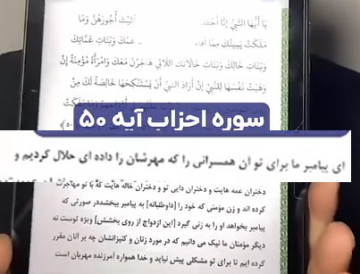

<video src="./claim-part1.mp4" controls>

# جواب

عه !؟ همچین آیه نداریم !

خدا نمیگه زنان فراوانی به تو حلال کردیم
خدا میگه :

### ای پیامبر ما همسران تو رو که مهرشان را پرداخت کرده ای برای تو حلال کردیم

<video src="./claim-part2.mp4" controls>

# ادامه جواب

مگه بقیه نمیتونن با دختر دایی و دختر عمو و دختر خاله و دختر عمه ازدواج کنن؟!

<video src="./claim-part3.mp4" controls>

# ادامه جواب 

 یعنی الان اگر یک خانمی از یک آقایی خوشش بیاد 
 و بهش پیشنهاد ازدواج بده اون آقا نمیتونه باهاش ازواج کنه ؟
 میتونه باهاش ازواج کنه ، ولی با پرداخت مهریه
 ولو اینکه با یک شاخه گل باشه
 در اینجا که خدا میگه 
### این حکم مختص پیامبره : اینکه بدون پرداخت مهریه پیامبر میتونه باهاش ازدواج بکنه
 این درحالی هست که ازدواج پیامبر با خانمی بدون پرداخت مهریه هرگز ثابت نشده 
 خیلی از احکامه که مخصوص پیامبره مثل نماز تهجد 
 که بر پیامبر واجب بود ولی برای ما (مسلمانان) نیست و خیلی از مسائل دیگه

<video src="./claim-part4.mp4" controls>

# ادامه جواب 

 نقش خداوند بعنوان خالق و آفریدگار و قانونگذار اینکه 
## احکام و قوانین رو تعیین میکنه

<video src="./claim-part5.mp4" controls>

# ادامه جواب

 همه قرآن فقط این نیست 
 قرآن 6236 ایه داره که 
 درمورد کیهان و جهان هستی و هدف خلقت توضیح داده
 که فقط 13 ایه مربوط به مسائل زندگی پیامبره 
 قرآن کتاب کیهان شناسی نیست که انتظار داشته باشیم 
 فقط درمورد ستاره هاو کهکشان ها حرف بزنه

 #### قران کتاب هدایته--